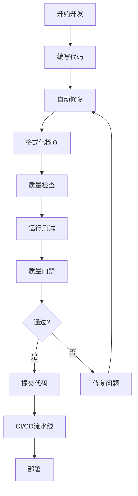

# VIVTransformer 代码质量与可维护性指南

本指南详细介绍了VIVTransformer项目的代码质量保证体系，包括工具配置、使用方法和最佳实践。

## 📋 目录

- [快速开始](#快速开始)
- [工具概览](#工具概览)
- [开发工作流](#开发工作流)
- [脚本详解](#脚本详解)
- [配置文件](#配置文件)
- [CI/CD集成](#cicd集成)
- [质量门禁](#质量门禁)
- [故障排除](#故障排除)

## 🚀 快速开始

### 1. 环境设置

```bash
# 一键设置完整开发环境
python setup_dev_env.py

# 或者分步骤设置
python setup_dev_env.py --skip-deps  # 跳过依赖安装
python setup_dev_env.py --skip-precommit  # 跳过pre-commit设置
```

### 2. 日常开发

```bash
# 运行所有开发工具
python scripts/dev_tools.py --all

# 或者分别运行
python scripts/dev_tools.py --fix      # 自动修复
python scripts/dev_tools.py --format   # 代码格式化
python scripts/dev_tools.py --quality  # 质量检查
python scripts/dev_tools.py --test     # 运行测试
python scripts/dev_tools.py --dashboard # 生成报告
```

### 3. 快速验证

```bash
# 快速测试核心功能
python scripts/quick_test.py

# 质量门禁检查
python scripts/quality_gate.py --config quality_gate.json
```

## 🛠️ 工具概览

### 代码格式化工具

| 工具 | 用途 | 配置文件 |
|------|------|----------|
| **Black** | Python代码格式化 | `pyproject.toml` |
| **isort** | 导入语句排序 | `pyproject.toml` |
| **autopep8** | PEP8格式化 | `pyproject.toml` |
| **docformatter** | 文档字符串格式化 | `pyproject.toml` |
| **unimport** | 移除未使用导入 | 内置配置 |

### 代码质量检查工具

| 工具 | 用途 | 配置文件 |
|------|------|----------|
| **flake8** | 代码风格检查 | `.flake8` |
| **mypy** | 静态类型检查 | `pyproject.toml` |
| **pylint** | 代码质量分析 | `pyproject.toml` |
| **bandit** | 安全漏洞检查 | `pyproject.toml` |
| **vulture** | 死代码检测 | `pyproject.toml` |
| **radon** | 复杂度分析 | `pyproject.toml` |
| **pydocstyle** | 文档字符串检查 | `pyproject.toml` |
| **xenon** | 复杂度监控 | 命令行参数 |

### 测试工具

| 工具 | 用途 | 配置文件 |
|------|------|----------|
| **pytest** | 单元测试框架 | `pyproject.toml` |
| **pytest-cov** | 测试覆盖率 | `pyproject.toml` |
| **pytest-xdist** | 并行测试 | 命令行参数 |
| **pytest-mock** | 模拟对象 | 内置配置 |

## 🔄 开发工作流

### 标准开发流程



### Pre-commit钩子流程

1. **pre-commit阶段**:
   - 基础文件检查
   - 代码格式化
   - 语法检查
   - 安全检查

2. **pre-push阶段**:
   - 完整质量检查
   - 测试覆盖率验证
   - 复杂度分析

## 📜 脚本详解

### setup_dev_env.py
**用途**: 一键设置完整开发环境

```bash
# 完整设置
python setup_dev_env.py

# 自定义项目路径
python setup_dev_env.py --project-root /path/to/project

# 跳过特定步骤
python setup_dev_env.py --skip-deps --skip-precommit
```

**功能**:
- ✅ Python版本检查
- 📦 依赖包安装
- 🪝 Pre-commit钩子设置
- 📁 目录结构创建
- 📝 开发脚本生成
- 🔍 初始质量检查

### code_quality.py
**用途**: 综合代码质量检查

```bash
# 运行所有工具
python scripts/code_quality.py --tools all

# 运行特定工具
python scripts/code_quality.py --tools flake8,mypy,bandit

# 指定目标目录
python scripts/code_quality.py --target-dirs src tests

# 生成JSON报告
python scripts/code_quality.py --output-format json
```

### format_code.py
**用途**: 代码格式化和检查

```bash
# 检查模式（不修改文件）
python scripts/format_code.py --check

# 格式化模式
python scripts/format_code.py --target-dirs src tests

# 激进模式（更多修复）
python scripts/format_code.py --aggressive
```

### auto_fix.py
**用途**: 自动修复常见问题

```bash
# 自动修复所有问题
python scripts/auto_fix.py --target-dirs src tests

# 预览模式（不实际修改）
python scripts/auto_fix.py --preview

# 选择性修复
python scripts/auto_fix.py --tools black,isort,unimport
```

### quality_gate.py
**用途**: 质量门禁检查

```bash
# 使用默认配置
python scripts/quality_gate.py

# 使用自定义配置
python scripts/quality_gate.py --config custom_gate.json

# 严格模式
python scripts/quality_gate.py --mode strict_mode

# 覆盖阈值
python scripts/quality_gate.py --coverage-threshold 90
```

### quality_dashboard.py
**用途**: 生成可视化质量报告

```bash
# 生成完整仪表板
python scripts/quality_dashboard.py

# 指定输出目录
python scripts/quality_dashboard.py --output-dir reports

# 包含历史趋势
python scripts/quality_dashboard.py --include-history
```

### dev_tools.py
**用途**: 综合开发工具入口

```bash
# 运行所有工具
python scripts/dev_tools.py --all

# 组合使用
python scripts/dev_tools.py --fix --format --quality
```

## ⚙️ 配置文件

### pyproject.toml
项目的主要配置文件，包含:
- 项目元数据
- 依赖管理
- 工具配置（Black, isort, MyPy, Pytest等）

### .pre-commit-config.yaml
Pre-commit钩子配置，包含:
- 基础文件检查
- 代码格式化钩子
- 质量检查钩子
- 自定义本地钩子

### quality_gate.json
质量门禁配置，定义:
- 质量阈值
- 工具启用状态
- 检查模式

### .flake8
Flake8专用配置文件

## 🔄 CI/CD集成

### GitHub Actions工作流

位置: `.github/workflows/ci-enhanced.yml`

**触发条件**:
- Push到主分支
- Pull Request
- 定时任务
- 手动触发

**主要阶段**:
1. **代码质量检查**
   - Pre-commit钩子
   - 质量工具运行
   - 格式化检查
   - 质量门禁

2. **测试执行**
   - 单元测试
   - 集成测试
   - 覆盖率报告

3. **安全扫描**
   - Bandit安全检查
   - Safety依赖检查
   - Semgrep代码扫描

4. **报告生成**
   - 质量报告上传
   - PR评论
   - 通知发送

### 本地CI模拟

```bash
# 模拟完整CI流程
python scripts/dev_tools.py --all
python scripts/quality_gate.py

# 运行pre-commit检查
pre-commit run --all-files
```

## 🚪 质量门禁

### 默认阈值

| 指标 | 阈值 | 说明 |
|------|------|------|
| 测试覆盖率 | ≥80% | 代码测试覆盖率 |
| 圈复杂度 | ≤10 | 单个函数复杂度 |
| 重复代码 | ≤5% | 代码重复率 |
| 关键问题 | 0个 | 严重质量问题 |
| 高级问题 | ≤5个 | 重要质量问题 |
| 中级问题 | ≤20个 | 一般质量问题 |

### 自定义配置

编辑 `quality_gate.json` 文件:

```json
{
  "quality_gate": {
    "coverage_threshold": 85,
    "complexity_threshold": 8,
    "duplication_threshold": 3,
    "critical_issues": 0,
    "high_issues": 3,
    "medium_issues": 15
  }
}
```

## 🔧 故障排除

### 常见问题

#### 1. 依赖安装失败
```bash
# 升级pip
python -m pip install --upgrade pip

# 清理缓存
pip cache purge

# 使用国内镜像
pip install -i https://pypi.tuna.tsinghua.edu.cn/simple/ package_name
```

#### 2. Pre-commit钩子失败
```bash
# 重新安装钩子
pre-commit uninstall
pre-commit install

# 更新钩子
pre-commit autoupdate

# 跳过特定钩子
COMMIT_EDITMSG="skip hooks" git commit -m "message" --no-verify
```

#### 3. 工具配置冲突
```bash
# 检查配置文件语法
python -c "import tomllib; tomllib.load(open('pyproject.toml', 'rb'))"

# 验证YAML文件
python -c "import yaml; yaml.safe_load(open('.pre-commit-config.yaml'))"
```

#### 4. 质量检查失败
```bash
# 查看详细错误
python scripts/code_quality.py --tools flake8 --show-details

# 自动修复
python scripts/auto_fix.py --target-dirs problematic_directory

# 逐步检查
python scripts/code_quality.py --tools flake8
python scripts/code_quality.py --tools mypy
python scripts/code_quality.py --tools bandit
```

### 性能优化

#### 1. 加速工具运行
```bash
# 并行运行pytest
pytest -n auto

# 缓存mypy结果
mypy --cache-dir=.mypy_cache

# 增量检查
flake8 --diff
```

#### 2. 减少检查范围
```bash
# 只检查修改的文件
python scripts/code_quality.py --target-dirs $(git diff --name-only HEAD~1)

# 排除特定目录
python scripts/code_quality.py --exclude-dirs build,dist,.git
```

## 📊 报告解读

### 质量仪表板

生成的HTML报告包含:
- 📈 **趋势图表**: 质量指标随时间变化
- 📊 **分布图表**: 问题类型和严重程度分布
- 📋 **详细列表**: 具体问题和建议修复方案
- 🎯 **质量评分**: 综合质量评分和等级

### JSON报告格式

```json
{
  "timestamp": "2024-01-01T12:00:00",
  "summary": {
    "total_issues": 15,
    "critical": 0,
    "high": 2,
    "medium": 8,
    "low": 5
  },
  "tools": {
    "flake8": {...},
    "mypy": {...},
    "bandit": {...}
  },
  "coverage": {
    "percentage": 85.5,
    "missing_lines": 145
  }
}
```

## 🎯 最佳实践

### 开发建议

1. **提交前检查**
   ```bash
   # 每次提交前运行
   python scripts/dev_tools.py --fix --format
   python scripts/quick_test.py
   ```

2. **定期质量检查**
   ```bash
   # 每周运行完整检查
   python scripts/quality_gate.py
   python scripts/quality_dashboard.py
   ```

3. **持续改进**
   - 定期审查质量报告
   - 调整质量阈值
   - 更新工具配置
   - 培训团队成员

### 团队协作

1. **统一配置**: 确保所有开发者使用相同的工具配置
2. **代码审查**: 结合质量检查结果进行代码审查
3. **知识分享**: 定期分享质量改进经验
4. **工具培训**: 确保团队熟悉各种质量工具

## 📚 参考资源

- [Black文档](https://black.readthedocs.io/)
- [isort文档](https://pycqa.github.io/isort/)
- [flake8文档](https://flake8.pycqa.org/)
- [mypy文档](https://mypy.readthedocs.io/)
- [pytest文档](https://docs.pytest.org/)
- [pre-commit文档](https://pre-commit.com/)

---

**维护者**: VIVTransformer开发团队  
**更新时间**: 2024年1月  
**版本**: 1.0.0