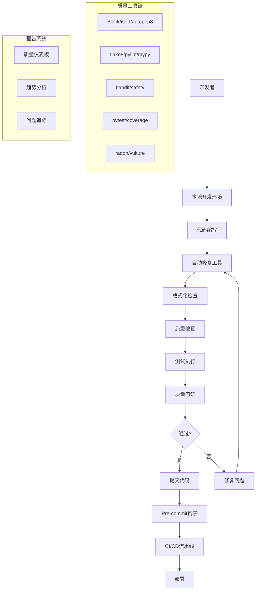

# VIVTransformer 代码质量与可维护性系统总结

## 🎯 系统概述

本文档总结了为VIVTransformer项目构建的完整代码质量与可维护性保证体系。该系统通过集成多种工具、自动化流程和最佳实践，确保代码质量的持续改进和项目的长期可维护性。

## 📊 系统架构



## 🛠️ 核心组件

### 1. 开发环境设置

#### setup_dev_env.py
- **功能**: 一键设置完整开发环境
- **特性**:
  - Python版本检查
  - 依赖包自动安装
  - Pre-commit钩子配置
  - 目录结构创建
  - 初始质量检查

#### 配置文件
- `pyproject.toml`: 项目配置和工具设置
- `.pre-commit-config.yaml`: Pre-commit钩子配置
- `quality_gate.json`: 质量门禁阈值配置

### 2. 代码质量工具链

#### 格式化工具
| 工具 | 用途 | 集成方式 |
|------|------|----------|
| **Black** | Python代码格式化 | scripts/format_code.py |
| **isort** | 导入语句排序 | scripts/format_code.py |
| **autopep8** | PEP8格式化 | scripts/auto_fix.py |
| **docformatter** | 文档字符串格式化 | scripts/auto_fix.py |
| **unimport** | 移除未使用导入 | scripts/auto_fix.py |

#### 质量检查工具
| 工具 | 用途 | 集成方式 |
|------|------|----------|
| **flake8** | 代码风格检查 | scripts/code_quality.py |
| **mypy** | 静态类型检查 | scripts/code_quality.py |
| **pylint** | 代码质量分析 | scripts/code_quality.py |
| **bandit** | 安全漏洞检查 | scripts/code_quality.py |
| **vulture** | 死代码检测 | scripts/code_quality.py |
| **radon** | 复杂度分析 | scripts/code_quality.py |
| **pydocstyle** | 文档字符串检查 | scripts/code_quality.py |
| **xenon** | 复杂度监控 | scripts/code_quality.py |

### 3. 自动化脚本系统

#### 核心脚本

1. **code_quality.py**
   - 综合代码质量检查
   - 支持多种输出格式
   - 可配置工具选择
   - 详细问题报告

2. **format_code.py**
   - 代码格式化和检查
   - 支持检查模式和修复模式
   - 激进模式选项
   - 格式化报告生成

3. **auto_fix.py**
   - 自动修复常见问题
   - 预览模式支持
   - 选择性工具运行
   - 修复报告生成

4. **quality_gate.py**
   - 质量门禁检查
   - 可配置阈值
   - 多种检查模式
   - 详细评估报告

5. **quality_dashboard.py**
   - 可视化质量报告
   - 趋势分析图表
   - 历史数据追踪
   - HTML仪表板生成

#### 辅助脚本

6. **dev_tools.py**
   - 综合开发工具入口
   - 支持组合命令
   - 统一接口设计

7. **quick_test.py**
   - 快速功能验证
   - 核心模块检查
   - 基础测试运行

### 4. CI/CD集成

#### GitHub Actions工作流

**文件**: `.github/workflows/ci-enhanced.yml`

**主要阶段**:
1. **代码质量检查**
   - Pre-commit钩子执行
   - 质量工具运行
   - 格式化验证
   - 质量门禁检查

2. **测试执行**
   - 单元测试
   - 集成测试
   - 覆盖率分析
   - GPU测试（如适用）

3. **安全扫描**
   - Bandit安全检查
   - Safety依赖检查
   - Semgrep代码扫描

4. **报告和通知**
   - 质量报告上传
   - PR评论
   - Slack通知

### 5. 质量门禁系统

#### 默认阈值配置

```json
{
  "quality_gate": {
    "coverage_threshold": 80,
    "complexity_threshold": 10,
    "duplication_threshold": 5,
    "critical_issues": 0,
    "high_issues": 5,
    "medium_issues": 20,
    "low_issues": 50
  }
}
```

#### 检查模式
- **quality_gate**: 标准模式
- **strict_mode**: 严格模式
- **relaxed_mode**: 宽松模式

### 6. 报告和可视化系统

#### 质量仪表板功能
- 📈 **趋势分析**: 质量指标随时间变化
- 📊 **分布图表**: 问题类型和严重程度分布
- 📋 **详细列表**: 具体问题和修复建议
- 🎯 **质量评分**: 综合质量评分和等级
- 📅 **历史追踪**: 质量改进历史记录

#### 报告格式
- **HTML**: 交互式仪表板
- **JSON**: 机器可读格式
- **Markdown**: 文档友好格式
- **文本**: 简洁摘要格式

## 🔄 工作流程

### 开发者日常工作流

```bash
# 1. 环境设置（首次）
dev setup

# 2. 日常开发
dev daily          # 自动修复 + 格式化 + 快速测试

# 3. 提交前检查
dev commit-ready   # 完整检查 + 质量门禁 + 报告生成

# 4. 查看质量报告
dev dashboard      # 生成可视化报告
```

### CI/CD流程

1. **触发条件**
   - Push到主分支
   - Pull Request创建/更新
   - 定时任务
   - 手动触发

2. **执行阶段**
   - 环境准备
   - 依赖安装
   - 代码检出
   - 质量检查
   - 测试执行
   - 报告生成
   - 结果通知

3. **质量门禁**
   - 自动评估
   - 阈值检查
   - 通过/失败判定
   - 详细报告生成

## 📈 质量指标

### 核心指标

| 指标类别 | 具体指标 | 目标值 | 监控工具 |
|----------|----------|--------|----------|
| **代码覆盖率** | 测试覆盖率 | ≥80% | pytest-cov |
| **代码复杂度** | 圈复杂度 | ≤10 | radon |
| **代码质量** | flake8评分 | 0错误 | flake8 |
| **类型安全** | mypy检查 | 0错误 | mypy |
| **安全性** | 安全漏洞 | 0高危 | bandit |
| **可维护性** | 重复代码率 | ≤5% | radon |
| **文档质量** | 文档覆盖率 | ≥70% | pydocstyle |

### 趋势监控

- **质量趋势**: 长期质量改进趋势
- **问题分布**: 不同类型问题的分布情况
- **修复效率**: 问题发现到修复的时间
- **团队表现**: 不同开发者的质量贡献

## 🛡️ 最佳实践

### 开发规范

1. **代码风格**
   - 遵循PEP8规范
   - 使用Black进行格式化
   - 保持一致的导入顺序

2. **类型注解**
   - 为函数参数和返回值添加类型注解
   - 使用mypy进行类型检查
   - 避免使用Any类型

3. **文档字符串**
   - 为所有公共函数添加文档字符串
   - 使用Google或NumPy风格
   - 包含参数和返回值说明

4. **测试覆盖**
   - 为核心功能编写单元测试
   - 保持测试覆盖率≥80%
   - 使用参数化测试提高效率

### 质量保证

1. **提交前检查**
   - 运行完整质量检查
   - 确保所有测试通过
   - 检查质量门禁状态

2. **代码审查**
   - 结合质量报告进行审查
   - 关注复杂度和可维护性
   - 验证安全性和性能

3. **持续改进**
   - 定期审查质量趋势
   - 调整质量阈值
   - 更新工具配置

## 🔧 工具配置

### 主要配置文件

1. **pyproject.toml**
   - 项目元数据
   - 依赖管理
   - 工具配置

2. **.pre-commit-config.yaml**
   - Pre-commit钩子
   - 自动化检查
   - 工具集成

3. **quality_gate.json**
   - 质量阈值
   - 检查模式
   - 工具启用状态

### 工具特定配置

- **Black**: 行长度120字符，Python 3.8+
- **isort**: 兼容Black，多行输出模式
- **flake8**: 忽略特定错误，最大行长度120
- **mypy**: 严格模式，忽略缺失导入
- **pytest**: 详细输出，覆盖率报告

## 📊 性能和效率

### 优化策略

1. **并行执行**
   - pytest并行测试
   - 多进程质量检查
   - 缓存机制利用

2. **增量检查**
   - 只检查修改的文件
   - 利用Git差异
   - 智能缓存策略

3. **工具选择**
   - 根据场景选择合适工具
   - 避免重复检查
   - 优化工具配置

### 性能指标

- **完整检查时间**: ~5-10分钟
- **快速检查时间**: ~1-2分钟
- **CI流水线时间**: ~15-20分钟
- **质量报告生成**: ~30秒

## 🚀 部署和维护

### 部署步骤

1. **初始设置**
   ```bash
   python setup_dev_env.py
   ```

2. **验证安装**
   ```bash
   dev status
   dev quick-test
   ```

3. **配置调整**
   - 根据项目需求调整阈值
   - 启用/禁用特定工具
   - 自定义检查规则

### 维护任务

1. **定期更新**
   - 更新工具版本
   - 调整配置参数
   - 优化性能设置

2. **监控和调优**
   - 监控质量趋势
   - 分析性能瓶颈
   - 优化工作流程

3. **团队培训**
   - 工具使用培训
   - 最佳实践分享
   - 问题解决指导

## 📋 故障排除

### 常见问题

1. **依赖冲突**
   - 使用虚拟环境
   - 固定版本号
   - 清理缓存

2. **配置错误**
   - 验证配置文件语法
   - 检查路径设置
   - 确认工具版本

3. **性能问题**
   - 启用并行处理
   - 减少检查范围
   - 优化工具配置

### 调试技巧

1. **详细日志**
   ```bash
   python scripts/code_quality.py --show-details
   ```

2. **单独测试**
   ```bash
   python scripts/code_quality.py --tools flake8
   ```

3. **配置验证**
   ```bash
   dev status
   ```

## 🎯 未来改进

### 短期目标

1. **工具集成**
   - 添加更多质量工具
   - 改进报告格式
   - 优化性能

2. **用户体验**
   - 简化配置过程
   - 改进错误信息
   - 增强文档

### 长期规划

1. **智能化**
   - AI辅助代码审查
   - 自动问题修复
   - 智能阈值调整

2. **集成扩展**
   - IDE插件开发
   - 云端服务集成
   - 团队协作功能

## 📚 总结

本代码质量与可维护性系统为VIVTransformer项目提供了:

✅ **完整的工具链**: 涵盖格式化、质量检查、测试、安全扫描等各个方面

✅ **自动化流程**: 从本地开发到CI/CD的全流程自动化

✅ **质量门禁**: 可配置的质量标准和自动化检查

✅ **可视化报告**: 直观的质量仪表板和趋势分析

✅ **易用接口**: 简单的命令行工具和批处理脚本

✅ **最佳实践**: 基于行业标准的开发规范和流程

通过这套系统，开发团队可以:
- 🚀 **提高开发效率**: 自动化重复任务，专注核心开发
- 🛡️ **保证代码质量**: 多层次质量检查，及早发现问题
- 📈 **持续改进**: 数据驱动的质量改进和趋势监控
- 🤝 **团队协作**: 统一的标准和工具，提高协作效率
- 🔒 **降低风险**: 安全检查和质量门禁，减少生产问题

这套系统不仅适用于VIVTransformer项目，也可以作为其他Python项目的质量保证体系模板，为软件开发的质量和可维护性提供强有力的支撑。

---

**文档版本**: 1.0.0  
**创建时间**: 2024年1月  
**维护团队**: VIVTransformer开发团队  
**联系方式**: 项目维护者邮箱