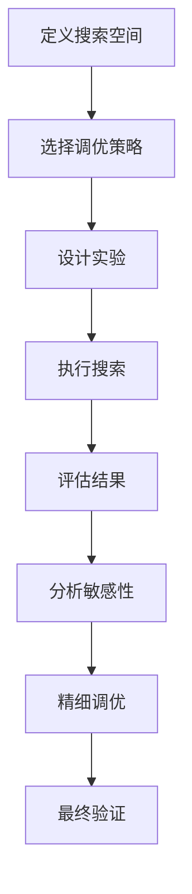

# 超参数调优指南

本文档提供VIVTransformer项目的全面超参数调优指南，包括调优策略、工具使用、最佳实践和实验设计。

## 📋 目录

- [调优概述](#调优概述)
- [核心超参数](#核心超参数)
- [调优策略](#调优策略)
- [自动化工具](#自动化工具)
- [实验设计](#实验设计)
- [性能评估](#性能评估)
- [最佳实践](#最佳实践)
- [案例研究](#案例研究)

## 调优概述

### 🎯 调优目标

超参数调优的主要目标：

1. **性能优化**: 最大化模型在验证集上的性能
2. **泛化能力**: 提高模型的泛化能力，避免过拟合
3. **训练效率**: 优化训练速度和资源利用率
4. **稳定性**: 确保训练过程的稳定性和可重复性
5. **可解释性**: 理解超参数对模型行为的影响

### 📊 调优流程



### 🔍 调优原则

1. **由粗到细**: 先进行粗粒度搜索，再进行精细调优
2. **分层调优**: 按重要性分层调优不同类型的超参数
3. **交叉验证**: 使用交叉验证确保结果的可靠性
4. **早停策略**: 使用早停避免浪费计算资源
5. **多目标优化**: 同时考虑性能、效率和稳定性

## 核心超参数

### 🏗️ 模型架构参数

```python
from typing import Dict, List, Tuple, Optional, Union
import numpy as np
from dataclasses import dataclass, field
from enum import Enum

class ParameterType(Enum):
    """参数类型枚举"""
    CONTINUOUS = "continuous"
    DISCRETE = "discrete"
    CATEGORICAL = "categorical"
    BOOLEAN = "boolean"

@dataclass
class ParameterSpace:
    """参数空间定义"""
    name: str
    param_type: ParameterType
    low: Optional[Union[float, int]] = None
    high: Optional[Union[float, int]] = None
    choices: Optional[List] = None
    log_scale: bool = False
    default: Optional[Union[float, int, str, bool]] = None
    description: str = ""
    importance: float = 1.0  # 参数重要性权重

# 定义VIVTransformer的核心超参数空间
VIV_HYPERPARAMETER_SPACE = {
    # 模型架构参数
    "model": {
        "d_model": ParameterSpace(
            name="d_model",
            param_type=ParameterType.DISCRETE,
            choices=[128, 256, 512, 768, 1024],
            default=512,
            description="模型维度",
            importance=0.9
        ),
        "num_layers": ParameterSpace(
            name="num_layers",
            param_type=ParameterType.DISCRETE,
            choices=[4, 6, 8, 12, 16],
            default=6,
            description="Transformer层数",
            importance=0.8
        ),
        "num_heads": ParameterSpace(
            name="num_heads",
            param_type=ParameterType.DISCRETE,
            choices=[4, 8, 12, 16],
            default=8,
            description="注意力头数",
            importance=0.7
        ),
        "d_ff": ParameterSpace(
            name="d_ff",
            param_type=ParameterType.DISCRETE,
            choices=[1024, 2048, 3072, 4096],
            default=2048,
            description="前馈网络维度",
            importance=0.6
        ),
        "dropout": ParameterSpace(
            name="dropout",
            param_type=ParameterType.CONTINUOUS,
            low=0.0,
            high=0.5,
            default=0.1,
            description="Dropout率",
            importance=0.8
        ),
        "attention_dropout": ParameterSpace(
            name="attention_dropout",
            param_type=ParameterType.CONTINUOUS,
            low=0.0,
            high=0.3,
            default=0.1,
            description="注意力Dropout率",
            importance=0.7
        )
    },
    
    # 注意力机制参数
    "attention": {
        "attention_type": ParameterSpace(
            name="attention_type",
            param_type=ParameterType.CATEGORICAL,
            choices=["standard", "linear", "sparse", "local", "global"],
            default="standard",
            description="注意力机制类型",
            importance=0.9
        ),
        "window_size": ParameterSpace(
            name="window_size",
            param_type=ParameterType.DISCRETE,
            choices=[32, 64, 128, 256, 512],
            default=128,
            description="局部注意力窗口大小",
            importance=0.6
        ),
        "sparsity_ratio": ParameterSpace(
            name="sparsity_ratio",
            param_type=ParameterType.CONTINUOUS,
            low=0.1,
            high=0.9,
            default=0.5,
            description="稀疏注意力比例",
            importance=0.5
        )
    },
    
    # 训练参数
    "training": {
        "learning_rate": ParameterSpace(
            name="learning_rate",
            param_type=ParameterType.CONTINUOUS,
            low=1e-5,
            high=1e-2,
            log_scale=True,
            default=1e-4,
            description="学习率",
            importance=1.0
        ),
        "batch_size": ParameterSpace(
            name="batch_size",
            param_type=ParameterType.DISCRETE,
            choices=[16, 32, 64, 128, 256],
            default=32,
            description="批次大小",
            importance=0.8
        ),
        "warmup_steps": ParameterSpace(
            name="warmup_steps",
            param_type=ParameterType.DISCRETE,
            low=100,
            high=10000,
            default=1000,
            description="预热步数",
            importance=0.6
        ),
        "weight_decay": ParameterSpace(
            name="weight_decay",
            param_type=ParameterType.CONTINUOUS,
            low=1e-6,
            high=1e-2,
            log_scale=True,
            default=1e-4,
            description="权重衰减",
            importance=0.7
        ),
        "gradient_clip_norm": ParameterSpace(
            name="gradient_clip_norm",
            param_type=ParameterType.CONTINUOUS,
            low=0.1,
            high=10.0,
            default=1.0,
            description="梯度裁剪范数",
            importance=0.5
        )
    },
    
    # 损失函数参数
    "loss": {
        "svd_weight": ParameterSpace(
            name="svd_weight",
            param_type=ParameterType.CONTINUOUS,
            low=1e-5,
            high=1e-1,
            log_scale=True,
            default=1e-3,
            description="SVD损失权重",
            importance=0.8
        ),
        "label_smoothing": ParameterSpace(
            name="label_smoothing",
            param_type=ParameterType.CONTINUOUS,
            low=0.0,
            high=0.3,
            default=0.1,
            description="标签平滑参数",
            importance=0.4
        )
    },
    
    # 优化器参数
    "optimizer": {
        "optimizer_type": ParameterSpace(
            name="optimizer_type",
            param_type=ParameterType.CATEGORICAL,
            choices=["adam", "adamw", "sgd", "rmsprop"],
            default="adamw",
            description="优化器类型",
            importance=0.7
        ),
        "beta1": ParameterSpace(
            name="beta1",
            param_type=ParameterType.CONTINUOUS,
            low=0.8,
            high=0.99,
            default=0.9,
            description="Adam beta1参数",
            importance=0.3
        ),
        "beta2": ParameterSpace(
            name="beta2",
            param_type=ParameterType.CONTINUOUS,
            low=0.9,
            high=0.999,
            default=0.999,
            description="Adam beta2参数",
            importance=0.3
        ),
        "eps": ParameterSpace(
            name="eps",
            param_type=ParameterType.CONTINUOUS,
            low=1e-10,
            high=1e-6,
            log_scale=True,
            default=1e-8,
            description="Adam epsilon参数",
            importance=0.2
        )
    }
}

class HyperparameterManager:
    """超参数管理器"""
    
    def __init__(self, parameter_space: Dict[str, Dict[str, ParameterSpace]]):
        self.parameter_space = parameter_space
        self.current_config = self._get_default_config()
        self.search_history = []
    
    def _get_default_config(self) -> Dict:
        """获取默认配置"""
        config = {}
        for category, params in self.parameter_space.items():
            config[category] = {}
            for param_name, param_space in params.items():
                config[category][param_name] = param_space.default
        return config
    
    def sample_random_config(self, seed: Optional[int] = None) -> Dict:
        """随机采样配置"""
        if seed is not None:
            np.random.seed(seed)
        
        config = {}
        for category, params in self.parameter_space.items():
            config[category] = {}
            for param_name, param_space in params.items():
                config[category][param_name] = self._sample_parameter(param_space)
        
        return config
    
    def _sample_parameter(self, param_space: ParameterSpace):
        """采样单个参数"""
        if param_space.param_type == ParameterType.CONTINUOUS:
            if param_space.log_scale:
                log_low = np.log(param_space.low)
                log_high = np.log(param_space.high)
                log_value = np.random.uniform(log_low, log_high)
                return np.exp(log_value)
            else:
                return np.random.uniform(param_space.low, param_space.high)
        
        elif param_space.param_type == ParameterType.DISCRETE:
            if param_space.choices:
                return np.random.choice(param_space.choices)
            else:
                return np.random.randint(param_space.low, param_space.high + 1)
        
        elif param_space.param_type == ParameterType.CATEGORICAL:
            return np.random.choice(param_space.choices)
        
        elif param_space.param_type == ParameterType.BOOLEAN:
            return np.random.choice([True, False])
        
        else:
            return param_space.default
    
    def validate_config(self, config: Dict) -> Tuple[bool, List[str]]:
        """验证配置的有效性"""
        errors = []
        
        # 检查配置完整性
        for category, params in self.parameter_space.items():
            if category not in config:
                errors.append(f"Missing category: {category}")
                continue
            
            for param_name, param_space in params.items():
                if param_name not in config[category]:
                    errors.append(f"Missing parameter: {category}.{param_name}")
                    continue
                
                value = config[category][param_name]
                if not self._validate_parameter_value(value, param_space):
                    errors.append(f"Invalid value for {category}.{param_name}: {value}")
        
        # 检查参数间的约束
        constraint_errors = self._check_parameter_constraints(config)
        errors.extend(constraint_errors)
        
        return len(errors) == 0, errors
    
    def _validate_parameter_value(self, value, param_space: ParameterSpace) -> bool:
        """验证单个参数值"""
        if param_space.param_type == ParameterType.CONTINUOUS:
            return param_space.low <= value <= param_space.high
        elif param_space.param_type == ParameterType.DISCRETE:
            if param_space.choices:
                return value in param_space.choices
            else:
                return param_space.low <= value <= param_space.high
        elif param_space.param_type == ParameterType.CATEGORICAL:
            return value in param_space.choices
        elif param_space.param_type == ParameterType.BOOLEAN:
            return isinstance(value, bool)
        return True
    
    def _check_parameter_constraints(self, config: Dict) -> List[str]:
        """检查参数间的约束"""
        errors = []
        
        # 检查模型维度约束
        if 'model' in config:
            d_model = config['model'].get('d_model', 512)
            num_heads = config['model'].get('num_heads', 8)
            
            if d_model % num_heads != 0:
                errors.append(f"d_model ({d_model}) must be divisible by num_heads ({num_heads})")
        
        # 检查注意力机制约束
        if 'attention' in config:
            attention_type = config['attention'].get('attention_type', 'standard')
            window_size = config['attention'].get('window_size', 128)
            
            if attention_type == 'local' and window_size <= 0:
                errors.append("Local attention requires positive window_size")
        
        # 检查训练参数约束
        if 'training' in config:
            batch_size = config['training'].get('batch_size', 32)
            learning_rate = config['training'].get('learning_rate', 1e-4)
            
            # 大批次通常需要更大的学习率
            if batch_size >= 128 and learning_rate < 1e-4:
                errors.append("Large batch size may require higher learning rate")
        
        return errors
    
    def get_parameter_importance_ranking(self) -> List[Tuple[str, float]]:
        """获取参数重要性排序"""
        importance_list = []
        
        for category, params in self.parameter_space.items():
            for param_name, param_space in params.items():
                full_name = f"{category}.{param_name}"
                importance_list.append((full_name, param_space.importance))
        
        return sorted(importance_list, key=lambda x: x[1], reverse=True)
    
    def record_experiment(self, config: Dict, metrics: Dict, metadata: Dict = None):
        """记录实验结果"""
        experiment = {
            'config': config.copy(),
            'metrics': metrics.copy(),
            'metadata': metadata or {},
            'timestamp': np.datetime64('now')
        }
        self.search_history.append(experiment)
    
    def get_best_config(self, metric_name: str = 'val_loss', minimize: bool = True) -> Tuple[Dict, Dict]:
        """获取最佳配置"""
        if not self.search_history:
            return self.current_config, {}
        
        valid_experiments = [exp for exp in self.search_history if metric_name in exp['metrics']]
        if not valid_experiments:
            return self.current_config, {}
        
        if minimize:
            best_exp = min(valid_experiments, key=lambda x: x['metrics'][metric_name])
        else:
            best_exp = max(valid_experiments, key=lambda x: x['metrics'][metric_name])
        
        return best_exp['config'], best_exp['metrics']
```

## 调优策略

### 🎲 随机搜索

```python
import random
from typing import Callable, Iterator
from concurrent.futures import ThreadPoolExecutor, as_completed
import time

class RandomSearchOptimizer:
    """随机搜索优化器"""
    
    def __init__(self, 
                 parameter_manager: HyperparameterManager,
                 objective_function: Callable,
                 n_trials: int = 100,
                 random_seed: int = 42,
                 early_stopping_patience: int = 20,
                 early_stopping_threshold: float = 1e-4):
        self.parameter_manager = parameter_manager
        self.objective_function = objective_function
        self.n_trials = n_trials
        self.random_seed = random_seed
        self.early_stopping_patience = early_stopping_patience
        self.early_stopping_threshold = early_stopping_threshold
        
        self.best_score = float('inf')
        self.best_config = None
        self.trial_history = []
        self.no_improvement_count = 0
    
    def optimize(self) -> Tuple[Dict, float]:
        """执行随机搜索优化"""
        random.seed(self.random_seed)
        np.random.seed(self.random_seed)
        
        print(f"Starting random search with {self.n_trials} trials...")
        
        for trial in range(self.n_trials):
            # 生成随机配置
            config = self.parameter_manager.sample_random_config()
            
            # 验证配置
            is_valid, errors = self.parameter_manager.validate_config(config)
            if not is_valid:
                print(f"Trial {trial}: Invalid config - {errors}")
                continue
            
            try:
                # 评估配置
                start_time = time.time()
                score, metrics = self.objective_function(config)
                duration = time.time() - start_time
                
                # 记录结果
                trial_info = {
                    'trial': trial,
                    'config': config,
                    'score': score,
                    'metrics': metrics,
                    'duration': duration
                }
                self.trial_history.append(trial_info)
                
                # 更新最佳结果
                if score < self.best_score:
                    improvement = self.best_score - score
                    self.best_score = score
                    self.best_config = config.copy()
                    self.no_improvement_count = 0
                    
                    print(f"Trial {trial}: New best score {score:.6f} (improvement: {improvement:.6f})")
                else:
                    self.no_improvement_count += 1
                    print(f"Trial {trial}: Score {score:.6f} (no improvement for {self.no_improvement_count} trials)")
                
                # 早停检查
                if self._should_early_stop():
                    print(f"Early stopping at trial {trial}")
                    break
                    
            except Exception as e:
                print(f"Trial {trial}: Error - {e}")
                continue
        
        return self.best_config, self.best_score
    
    def _should_early_stop(self) -> bool:
        """检查是否应该早停"""
        if self.no_improvement_count >= self.early_stopping_patience:
            return True
        
        # 检查改进是否足够小
        if len(self.trial_history) >= 2:
            recent_scores = [trial['score'] for trial in self.trial_history[-5:]]
            if len(recent_scores) >= 2:
                score_variance = np.var(recent_scores)
                if score_variance < self.early_stopping_threshold:
                    return True
        
        return False
    
    def get_optimization_summary(self) -> Dict:
        """获取优化摘要"""
        if not self.trial_history:
            return {}
        
        scores = [trial['score'] for trial in self.trial_history]
        durations = [trial['duration'] for trial in self.trial_history]
        
        return {
            'total_trials': len(self.trial_history),
            'best_score': self.best_score,
            'best_config': self.best_config,
            'score_statistics': {
                'mean': np.mean(scores),
                'std': np.std(scores),
                'min': np.min(scores),
                'max': np.max(scores),
                'median': np.median(scores)
            },
            'duration_statistics': {
                'total_time': np.sum(durations),
                'avg_time_per_trial': np.mean(durations),
                'min_time': np.min(durations),
                'max_time': np.max(durations)
            },
            'convergence_info': {
                'trials_to_best': next((i for i, trial in enumerate(self.trial_history) 
                                      if trial['score'] == self.best_score), -1),
                'improvement_rate': self._calculate_improvement_rate()
            }
        }
    
    def _calculate_improvement_rate(self) -> float:
        """计算改进率"""
        if len(self.trial_history) < 2:
            return 0.0
        
        first_score = self.trial_history[0]['score']
        last_score = self.trial_history[-1]['score']
        
        if first_score == 0:
            return 0.0
        
        return (first_score - last_score) / first_score
```

### 🎯 贝叶斯优化

```python
try:
    from skopt import gp_minimize
    from skopt.space import Real, Integer, Categorical
    from skopt.utils import use_named_args
    SKOPT_AVAILABLE = True
except ImportError:
    SKOPT_AVAILABLE = False
    print("Warning: scikit-optimize not available. Bayesian optimization disabled.")

class BayesianOptimizer:
    """贝叶斯优化器"""
    
    def __init__(self, 
                 parameter_manager: HyperparameterManager,
                 objective_function: Callable,
                 n_calls: int = 50,
                 n_initial_points: int = 10,
                 acquisition_function: str = 'EI',
                 random_seed: int = 42):
        
        if not SKOPT_AVAILABLE:
            raise ImportError("scikit-optimize is required for Bayesian optimization")
        
        self.parameter_manager = parameter_manager
        self.objective_function = objective_function
        self.n_calls = n_calls
        self.n_initial_points = n_initial_points
        self.acquisition_function = acquisition_function
        self.random_seed = random_seed
        
        self.search_space = self._build_search_space()
        self.dimension_names = self._get_dimension_names()
        self.optimization_result = None
    
    def _build_search_space(self) -> List:
        """构建搜索空间"""
        space = []
        
        for category, params in self.parameter_manager.parameter_space.items():
            for param_name, param_space in params.items():
                if param_space.param_type == ParameterType.CONTINUOUS:
                    if param_space.log_scale:
                        space.append(Real(param_space.low, param_space.high, 
                                        prior='log-uniform', name=f"{category}.{param_name}"))
                    else:
                        space.append(Real(param_space.low, param_space.high, 
                                        name=f"{category}.{param_name}"))
                
                elif param_space.param_type == ParameterType.DISCRETE:
                    if param_space.choices:
                        space.append(Categorical(param_space.choices, 
                                               name=f"{category}.{param_name}"))
                    else:
                        space.append(Integer(param_space.low, param_space.high, 
                                           name=f"{category}.{param_name}"))
                
                elif param_space.param_type == ParameterType.CATEGORICAL:
                    space.append(Categorical(param_space.choices, 
                                           name=f"{category}.{param_name}"))
                
                elif param_space.param_type == ParameterType.BOOLEAN:
                    space.append(Categorical([True, False], 
                                           name=f"{category}.{param_name}"))
        
        return space
    
    def _get_dimension_names(self) -> List[str]:
        """获取维度名称"""
        names = []
        for category, params in self.parameter_manager.parameter_space.items():
            for param_name in params.keys():
                names.append(f"{category}.{param_name}")
        return names
    
    def _convert_to_config(self, x: List) -> Dict:
        """将优化器参数转换为配置字典"""
        config = {}
        
        for i, (category_param, value) in enumerate(zip(self.dimension_names, x)):
            category, param_name = category_param.split('.', 1)
            
            if category not in config:
                config[category] = {}
            
            config[category][param_name] = value
        
        return config
    
    def optimize(self) -> Tuple[Dict, float]:
        """执行贝叶斯优化"""
        @use_named_args(self.search_space)
        def objective(**params):
            # 转换参数格式
            config = {}
            for param_name, value in params.items():
                category, param = param_name.split('.', 1)
                if category not in config:
                    config[category] = {}
                config[category][param] = value
            
            # 验证配置
            is_valid, errors = self.parameter_manager.validate_config(config)
            if not is_valid:
                print(f"Invalid config: {errors}")
                return 1e6  # 返回一个很大的值表示无效配置
            
            try:
                score, metrics = self.objective_function(config)
                return score
            except Exception as e:
                print(f"Evaluation error: {e}")
                return 1e6
        
        print(f"Starting Bayesian optimization with {self.n_calls} calls...")
        
        self.optimization_result = gp_minimize(
            func=objective,
            dimensions=self.search_space,
            n_calls=self.n_calls,
            n_initial_points=self.n_initial_points,
            acq_func=self.acquisition_function,
            random_state=self.random_seed,
            verbose=True
        )
        
        # 获取最佳配置
        best_config = self._convert_to_config(self.optimization_result.x)
        best_score = self.optimization_result.fun
        
        return best_config, best_score
    
    def get_optimization_summary(self) -> Dict:
        """获取优化摘要"""
        if self.optimization_result is None:
            return {}
        
        return {
            'best_score': self.optimization_result.fun,
            'best_params': dict(zip(self.dimension_names, self.optimization_result.x)),
            'n_calls': len(self.optimization_result.func_vals),
            'convergence_info': {
                'func_vals': self.optimization_result.func_vals,
                'x_iters': self.optimization_result.x_iters
            }
        }
```

### 🔄 网格搜索

```python
from itertools import product
from typing import Generator

class GridSearchOptimizer:
    """网格搜索优化器"""
    
    def __init__(self, 
                 parameter_manager: HyperparameterManager,
                 objective_function: Callable,
                 grid_config: Dict[str, List],
                 max_combinations: Optional[int] = None):
        self.parameter_manager = parameter_manager
        self.objective_function = objective_function
        self.grid_config = grid_config
        self.max_combinations = max_combinations
        
        self.best_score = float('inf')
        self.best_config = None
        self.results = []
    
    def _generate_grid_combinations(self) -> Generator[Dict, None, None]:
        """生成网格搜索的所有组合"""
        # 解析网格配置
        param_names = []
        param_values = []
        
        for param_path, values in self.grid_config.items():
            param_names.append(param_path)
            param_values.append(values)
        
        # 生成所有组合
        combinations = list(product(*param_values))
        
        # 限制组合数量
        if self.max_combinations and len(combinations) > self.max_combinations:
            combinations = random.sample(combinations, self.max_combinations)
        
        for combination in combinations:
            config = self.parameter_manager._get_default_config()
            
            # 应用网格参数
            for param_path, value in zip(param_names, combination):
                self._set_nested_value(config, param_path, value)
            
            yield config
    
    def _set_nested_value(self, config: Dict, param_path: str, value):
        """设置嵌套字典的值"""
        keys = param_path.split('.')
        current = config
        
        for key in keys[:-1]:
            if key not in current:
                current[key] = {}
            current = current[key]
        
        current[keys[-1]] = value
    
    def optimize(self) -> Tuple[Dict, float]:
        """执行网格搜索"""
        total_combinations = self._count_combinations()
        print(f"Starting grid search with {total_combinations} combinations...")
        
        for i, config in enumerate(self._generate_grid_combinations()):
            # 验证配置
            is_valid, errors = self.parameter_manager.validate_config(config)
            if not is_valid:
                print(f"Combination {i}: Invalid config - {errors}")
                continue
            
            try:
                # 评估配置
                start_time = time.time()
                score, metrics = self.objective_function(config)
                duration = time.time() - start_time
                
                # 记录结果
                result = {
                    'combination': i,
                    'config': config,
                    'score': score,
                    'metrics': metrics,
                    'duration': duration
                }
                self.results.append(result)
                
                # 更新最佳结果
                if score < self.best_score:
                    self.best_score = score
                    self.best_config = config.copy()
                    print(f"Combination {i}: New best score {score:.6f}")
                else:
                    print(f"Combination {i}: Score {score:.6f}")
                    
            except Exception as e:
                print(f"Combination {i}: Error - {e}")
                continue
        
        return self.best_config, self.best_score
    
    def _count_combinations(self) -> int:
        """计算组合总数"""
        total = 1
        for values in self.grid_config.values():
            total *= len(values)
        
        if self.max_combinations:
            return min(total, self.max_combinations)
        return total
    
    def get_optimization_summary(self) -> Dict:
        """获取优化摘要"""
        if not self.results:
            return {}
        
        scores = [result['score'] for result in self.results]
        durations = [result['duration'] for result in self.results]
        
        return {
            'total_combinations': len(self.results),
            'best_score': self.best_score,
            'best_config': self.best_config,
            'score_statistics': {
                'mean': np.mean(scores),
                'std': np.std(scores),
                'min': np.min(scores),
                'max': np.max(scores),
                'median': np.median(scores)
            },
            'duration_statistics': {
                'total_time': np.sum(durations),
                'avg_time_per_combination': np.mean(durations)
            }
        }
```

## 自动化工具

### 🤖 Optuna集成

```python
try:
    import optuna
    from optuna.samplers import TPESampler, RandomSampler
    from optuna.pruners import MedianPruner, HyperbandPruner
    OPTUNA_AVAILABLE = True
except ImportError:
    OPTUNA_AVAILABLE = False
    print("Warning: Optuna not available. Advanced optimization disabled.")

class OptunaOptimizer:
    """Optuna优化器"""
    
    def __init__(self, 
                 parameter_manager: HyperparameterManager,
                 objective_function: Callable,
                 study_name: str = "vivtransformer_optimization",
                 n_trials: int = 100,
                 sampler_type: str = "tpe",
                 pruner_type: str = "median",
                 direction: str = "minimize"):
        
        if not OPTUNA_AVAILABLE:
            raise ImportError("Optuna is required for advanced optimization")
        
        self.parameter_manager = parameter_manager
        self.objective_function = objective_function
        self.study_name = study_name
        self.n_trials = n_trials
        self.direction = direction
        
        # 创建采样器
        if sampler_type == "tpe":
            self.sampler = TPESampler()
        elif sampler_type == "random":
            self.sampler = RandomSampler()
        else:
            self.sampler = TPESampler()
        
        # 创建剪枝器
        if pruner_type == "median":
            self.pruner = MedianPruner()
        elif pruner_type == "hyperband":
            self.pruner = HyperbandPruner()
        else:
            self.pruner = MedianPruner()
        
        # 创建研究
        self.study = optuna.create_study(
            study_name=self.study_name,
            direction=self.direction,
            sampler=self.sampler,
            pruner=self.pruner
        )
    
    def _suggest_parameters(self, trial: optuna.Trial) -> Dict:
        """建议参数"""
        config = {}
        
        for category, params in self.parameter_manager.parameter_space.items():
            config[category] = {}
            
            for param_name, param_space in params.items():
                full_name = f"{category}_{param_name}"
                
                if param_space.param_type == ParameterType.CONTINUOUS:
                    if param_space.log_scale:
                        value = trial.suggest_loguniform(
                            full_name, param_space.low, param_space.high
                        )
                    else:
                        value = trial.suggest_uniform(
                            full_name, param_space.low, param_space.high
                        )
                
                elif param_space.param_type == ParameterType.DISCRETE:
                    if param_space.choices:
                        value = trial.suggest_categorical(full_name, param_space.choices)
                    else:
                        value = trial.suggest_int(
                            full_name, param_space.low, param_space.high
                        )
                
                elif param_space.param_type == ParameterType.CATEGORICAL:
                    value = trial.suggest_categorical(full_name, param_space.choices)
                
                elif param_space.param_type == ParameterType.BOOLEAN:
                    value = trial.suggest_categorical(full_name, [True, False])
                
                else:
                    value = param_space.default
                
                config[category][param_name] = value
        
        return config
    
    def _objective_wrapper(self, trial: optuna.Trial) -> float:
        """目标函数包装器"""
        # 建议参数
        config = self._suggest_parameters(trial)
        
        # 验证配置
        is_valid, errors = self.parameter_manager.validate_config(config)
        if not is_valid:
            print(f"Trial {trial.number}: Invalid config - {errors}")
            raise optuna.TrialPruned()
        
        try:
            # 评估配置
            score, metrics = self.objective_function(config, trial)
            
            # 记录额外指标
            for metric_name, metric_value in metrics.items():
                if metric_name != 'score':
                    trial.set_user_attr(metric_name, metric_value)
            
            return score
            
        except Exception as e:
            print(f"Trial {trial.number}: Error - {e}")
            raise optuna.TrialPruned()
    
    def optimize(self) -> Tuple[Dict, float]:
        """执行优化"""
        print(f"Starting Optuna optimization with {self.n_trials} trials...")
        
        self.study.optimize(
            self._objective_wrapper,
            n_trials=self.n_trials,
            show_progress_bar=True
        )
        
        # 获取最佳结果
        best_trial = self.study.best_trial
        best_config = self._convert_trial_params_to_config(best_trial.params)
        best_score = best_trial.value
        
        return best_config, best_score
    
    def _convert_trial_params_to_config(self, params: Dict) -> Dict:
        """将试验参数转换为配置"""
        config = {}
        
        for param_name, value in params.items():
            # 解析参数名称
            parts = param_name.split('_', 1)
            if len(parts) == 2:
                category, param = parts
                if category not in config:
                    config[category] = {}
                config[category][param] = value
        
        return config
    
    def get_optimization_summary(self) -> Dict:
        """获取优化摘要"""
        return {
            'best_score': self.study.best_value,
            'best_params': self.study.best_params,
            'n_trials': len(self.study.trials),
            'study_statistics': {
                'completed_trials': len([t for t in self.study.trials if t.state == optuna.trial.TrialState.COMPLETE]),
                'pruned_trials': len([t for t in self.study.trials if t.state == optuna.trial.TrialState.PRUNED]),
                'failed_trials': len([t for t in self.study.trials if t.state == optuna.trial.TrialState.FAIL])
            }
        }
    
    def plot_optimization_history(self):
        """绘制优化历史"""
        if OPTUNA_AVAILABLE:
            return optuna.visualization.plot_optimization_history(self.study)
        else:
            print("Optuna visualization not available")
    
    def plot_param_importances(self):
        """绘制参数重要性"""
        if OPTUNA_AVAILABLE:
            return optuna.visualization.plot_param_importances(self.study)
        else:
            print("Optuna visualization not available")
```

## 实验设计

### 📊 实验管理器

```python
import json
import os
from datetime import datetime
from pathlib import Path
import pickle
import hashlib

class ExperimentManager:
    """实验管理器"""
    
    def __init__(self, 
                 experiment_dir: str = "experiments",
                 auto_save: bool = True,
                 save_models: bool = False):
        self.experiment_dir = Path(experiment_dir)
        self.experiment_dir.mkdir(exist_ok=True)
        self.auto_save = auto_save
        self.save_models = save_models
        
        self.current_experiment = None
        self.experiments = self._load_experiments()
    
    def create_experiment(self, 
                         name: str,
                         description: str = "",
                         tags: List[str] = None,
                         config: Dict = None) -> str:
        """创建新实验"""
        experiment_id = self._generate_experiment_id(name)
        
        experiment = {
            'id': experiment_id,
            'name': name,
            'description': description,
            'tags': tags or [],
            'config': config or {},
            'created_at': datetime.now().isoformat(),
            'status': 'created',
            'trials': [],
            'best_trial': None,
            'metadata': {}
        }
        
        self.experiments[experiment_id] = experiment
        self.current_experiment = experiment_id
        
        if self.auto_save:
            self._save_experiments()
        
        return experiment_id
    
    def add_trial(self, 
                 experiment_id: str,
                 config: Dict,
                 metrics: Dict,
                 model_path: str = None,
                 metadata: Dict = None) -> str:
        """添加试验"""
        if experiment_id not in self.experiments:
            raise ValueError(f"Experiment {experiment_id} not found")
        
        trial_id = self._generate_trial_id(experiment_id)
        
        trial = {
            'id': trial_id,
            'config': config,
            'metrics': metrics,
            'model_path': model_path,
            'metadata': metadata or {},
            'created_at': datetime.now().isoformat(),
            'duration': metadata.get('duration', 0) if metadata else 0
        }
        
        self.experiments[experiment_id]['trials'].append(trial)
        
        # 更新最佳试验
        self._update_best_trial(experiment_id, trial)
        
        if self.auto_save:
            self._save_experiments()
        
        return trial_id
    
    def _update_best_trial(self, experiment_id: str, trial: Dict):
        """更新最佳试验"""
        experiment = self.experiments[experiment_id]
        
        # 假设使用验证损失作为主要指标
        current_score = trial['metrics'].get('val_loss', float('inf'))
        
        if experiment['best_trial'] is None:
            experiment['best_trial'] = trial
        else:
            best_score = experiment['best_trial']['metrics'].get('val_loss', float('inf'))
            if current_score < best_score:
                experiment['best_trial'] = trial
    
    def get_experiment_summary(self, experiment_id: str) -> Dict:
        """获取实验摘要"""
        if experiment_id not in self.experiments:
            raise ValueError(f"Experiment {experiment_id} not found")
        
        experiment = self.experiments[experiment_id]
        trials = experiment['trials']
        
        if not trials:
            return {
                'experiment_id': experiment_id,
                'name': experiment['name'],
                'status': experiment['status'],
                'n_trials': 0
            }
        
        # 计算统计信息
        scores = [trial['metrics'].get('val_loss', float('inf')) for trial in trials]
        durations = [trial['duration'] for trial in trials]
        
        summary = {
            'experiment_id': experiment_id,
            'name': experiment['name'],
            'description': experiment['description'],
            'status': experiment['status'],
            'n_trials': len(trials),
            'best_score': min(scores) if scores else float('inf'),
            'best_trial_id': experiment['best_trial']['id'] if experiment['best_trial'] else None,
            'score_statistics': {
                'mean': np.mean(scores),
                'std': np.std(scores),
                'min': np.min(scores),
                'max': np.max(scores),
                'median': np.median(scores)
            } if scores else {},
            'duration_statistics': {
                'total_time': np.sum(durations),
                'avg_time_per_trial': np.mean(durations),
                'min_time': np.min(durations),
                'max_time': np.max(durations)
            } if durations else {},
            'created_at': experiment['created_at'],
            'tags': experiment['tags']
        }
        
        return summary
    
    def compare_experiments(self, experiment_ids: List[str]) -> Dict:
        """比较多个实验"""
        comparison = {
            'experiments': {},
            'best_overall': None,
            'comparison_metrics': {}
        }
        
        best_score = float('inf')
        best_experiment = None
        
        for exp_id in experiment_ids:
            if exp_id not in self.experiments:
                continue
            
            summary = self.get_experiment_summary(exp_id)
            comparison['experiments'][exp_id] = summary
            
            if summary['best_score'] < best_score:
                best_score = summary['best_score']
                best_experiment = exp_id
        
        comparison['best_overall'] = best_experiment
        
        # 计算比较指标
        if len(comparison['experiments']) > 1:
            scores = [exp['best_score'] for exp in comparison['experiments'].values()]
            comparison['comparison_metrics'] = {
                'score_range': max(scores) - min(scores),
                'score_std': np.std(scores),
                'improvement_over_worst': (max(scores) - min(scores)) / max(scores) if max(scores) > 0 else 0
            }
        
        return comparison
    
    def export_experiment(self, experiment_id: str, export_path: str):
        """导出实验"""
        if experiment_id not in self.experiments:
            raise ValueError(f"Experiment {experiment_id} not found")
        
        experiment = self.experiments[experiment_id]
        
        with open(export_path, 'w') as f:
            json.dump(experiment, f, indent=2, default=str)
    
    def import_experiment(self, import_path: str) -> str:
        """导入实验"""
        with open(import_path, 'r') as f:
            experiment = json.load(f)
        
        experiment_id = experiment['id']
        self.experiments[experiment_id] = experiment
        
        if self.auto_save:
            self._save_experiments()
        
        return experiment_id
    
    def _generate_experiment_id(self, name: str) -> str:
        """生成实验ID"""
        timestamp = datetime.now().strftime("%Y%m%d_%H%M%S")
        name_hash = hashlib.md5(name.encode()).hexdigest()[:8]
        return f"{name}_{timestamp}_{name_hash}"
    
    def _generate_trial_id(self, experiment_id: str) -> str:
        """生成试验ID"""
        experiment = self.experiments[experiment_id]
        trial_count = len(experiment['trials'])
        return f"{experiment_id}_trial_{trial_count:04d}"
    
    def _save_experiments(self):
        """保存实验数据"""
        experiments_file = self.experiment_dir / "experiments.json"
        with open(experiments_file, 'w') as f:
            json.dump(self.experiments, f, indent=2, default=str)
    
    def _load_experiments(self) -> Dict:
        """加载实验数据"""
        experiments_file = self.experiment_dir / "experiments.json"
        if experiments_file.exists():
            with open(experiments_file, 'r') as f:
                return json.load(f)
        return {}
```

## 性能评估

### 📈 评估指标

```python
class HyperparameterEvaluator:
    """超参数评估器"""
    
    def __init__(self, 
                 metrics: List[str] = None,
                 cross_validation_folds: int = 5,
                 test_size: float = 0.2,
                 random_seed: int = 42):
        self.metrics = metrics or ['val_loss', 'val_accuracy', 'train_time', 'inference_time']
        self.cv_folds = cross_validation_folds
        self.test_size = test_size
        self.random_seed = random_seed
    
    def evaluate_config(self, 
                       config: Dict,
                       train_function: Callable,
                       data_loader: Callable,
                       use_cross_validation: bool = True) -> Tuple[float, Dict]:
        """评估单个配置"""
        if use_cross_validation:
            return self._evaluate_with_cv(config, train_function, data_loader)
        else:
            return self._evaluate_single_split(config, train_function, data_loader)
    
    def _evaluate_with_cv(self, 
                         config: Dict,
                         train_function: Callable,
                         data_loader: Callable) -> Tuple[float, Dict]:
        """使用交叉验证评估"""
        fold_results = []
        
        for fold in range(self.cv_folds):
            # 获取折叠数据
            train_data, val_data = data_loader(fold=fold, total_folds=self.cv_folds)
            
            # 训练模型
            start_time = time.time()
            model, train_metrics = train_function(config, train_data, val_data)
            train_time = time.time() - start_time
            
            # 评估模型
            val_metrics = self._evaluate_model(model, val_data)
            
            # 合并指标
            fold_result = {
                **train_metrics,
                **val_metrics,
                'train_time': train_time,
                'fold': fold
            }
            fold_results.append(fold_result)
        
        # 聚合结果
        aggregated_metrics = self._aggregate_cv_results(fold_results)
        
        # 计算主要分数（通常是验证损失）
        main_score = aggregated_metrics.get('val_loss_mean', float('inf'))
        
        return main_score, aggregated_metrics
    
    def _evaluate_single_split(self, 
                              config: Dict,
                              train_function: Callable,
                              data_loader: Callable) -> Tuple[float, Dict]:
        """使用单次分割评估"""
        # 获取数据
        train_data, val_data = data_loader(test_size=self.test_size)
        
        # 训练模型
        start_time = time.time()
        model, train_metrics = train_function(config, train_data, val_data)
        train_time = time.time() - start_time
        
        # 评估模型
        val_metrics = self._evaluate_model(model, val_data)
        
        # 合并指标
        all_metrics = {
            **train_metrics,
            **val_metrics,
            'train_time': train_time
        }
        
        main_score = all_metrics.get('val_loss', float('inf'))
        
        return main_score, all_metrics
    
    def _evaluate_model(self, model, val_data) -> Dict:
        """评估模型性能"""
        model.eval()
        metrics = {}
        
        total_loss = 0.0
        total_samples = 0
        correct_predictions = 0
        
        start_time = time.time()
        
        with torch.no_grad():
            for batch in val_data:
                outputs = model(batch['input'])
                loss = F.mse_loss(outputs, batch['target'])
                
                total_loss += loss.item() * batch['input'].size(0)
                total_samples += batch['input'].size(0)
                
                # 计算准确率（如果是分类任务）
                if 'labels' in batch:
                    predictions = torch.argmax(outputs, dim=-1)
                    correct_predictions += (predictions == batch['labels']).sum().item()
        
        inference_time = time.time() - start_time
        
        metrics['val_loss'] = total_loss / total_samples
        metrics['inference_time'] = inference_time
        
        if correct_predictions > 0:
            metrics['val_accuracy'] = correct_predictions / total_samples
        
        return metrics
    
    def _aggregate_cv_results(self, fold_results: List[Dict]) -> Dict:
        """聚合交叉验证结果"""
        aggregated = {}
        
        # 收集所有指标
        all_metrics = set()
        for result in fold_results:
            all_metrics.update(result.keys())
        
        # 计算每个指标的统计信息
        for metric in all_metrics:
            if metric == 'fold':
                continue
            
            values = [result.get(metric, 0) for result in fold_results if metric in result]
            
            if values:
                aggregated[f"{metric}_mean"] = np.mean(values)
                aggregated[f"{metric}_std"] = np.std(values)
                aggregated[f"{metric}_min"] = np.min(values)
                aggregated[f"{metric}_max"] = np.max(values)
        
        return aggregated
    
    def sensitivity_analysis(self, 
                           base_config: Dict,
                           parameter_ranges: Dict[str, List],
                           train_function: Callable,
                           data_loader: Callable) -> Dict:
        """敏感性分析"""
        sensitivity_results = {}
        
        for param_path, values in parameter_ranges.items():
            param_results = []
            
            for value in values:
                # 创建测试配置
                test_config = self._deep_copy_config(base_config)
                self._set_nested_value(test_config, param_path, value)
                
                # 评估配置
                score, metrics = self.evaluate_config(
                    test_config, train_function, data_loader, use_cross_validation=False
                )
                
                param_results.append({
                    'value': value,
                    'score': score,
                    'metrics': metrics
                })
            
            sensitivity_results[param_path] = {
                'values': values,
                'results': param_results,
                'sensitivity_score': self._calculate_sensitivity_score(param_results)
            }
        
        return sensitivity_results
    
    def _calculate_sensitivity_score(self, param_results: List[Dict]) -> float:
        """计算敏感性分数"""
        scores = [result['score'] for result in param_results]
        if len(scores) < 2:
            return 0.0
        
        # 使用变异系数作为敏感性指标
        mean_score = np.mean(scores)
        std_score = np.std(scores)
        
        if mean_score == 0:
            return 0.0
        
        return std_score / mean_score
    
    def _deep_copy_config(self, config: Dict) -> Dict:
        """深拷贝配置"""
        import copy
        return copy.deepcopy(config)
    
    def _set_nested_value(self, config: Dict, param_path: str, value):
        """设置嵌套字典的值"""
        keys = param_path.split('.')
        current = config
        
        for key in keys[:-1]:
            if key not in current:
                current[key] = {}
            current = current[key]
        
        current[keys[-1]] = value
```

## 最佳实践

### 🎯 调优策略建议

```python
class HyperparameterTuningBestPractices:
    """超参数调优最佳实践"""
    
    @staticmethod
    def get_tuning_strategy(dataset_size: int, 
                           compute_budget: int,
                           model_complexity: str = "medium") -> Dict:
        """根据数据集大小和计算预算推荐调优策略"""
        
        if dataset_size < 1000:
            # 小数据集
            return {
                'strategy': 'grid_search',
                'cv_folds': 10,
                'max_trials': 50,
                'focus_params': ['learning_rate', 'dropout', 'weight_decay'],
                'recommendations': [
                    "使用较高的正则化",
                    "考虑数据增强",
                    "使用较小的模型"
                ]
            }
        
        elif dataset_size < 10000:
            # 中等数据集
            return {
                'strategy': 'random_search',
                'cv_folds': 5,
                'max_trials': 100,
                'focus_params': ['learning_rate', 'batch_size', 'num_layers', 'dropout'],
                'recommendations': [
                    "平衡模型复杂度和正则化",
                    "考虑学习率调度",
                    "监控过拟合"
                ]
            }
        
        else:
            # 大数据集
            return {
                'strategy': 'bayesian_optimization',
                'cv_folds': 3,
                'max_trials': 200,
                'focus_params': ['learning_rate', 'batch_size', 'd_model', 'num_layers'],
                'recommendations': [
                    "可以使用更复杂的模型",
                    "关注训练效率",
                    "使用早停策略"
                ]
            }
    
    @staticmethod
    def get_parameter_priorities() -> Dict[str, int]:
        """获取参数调优优先级"""
        return {
            # 高优先级（1-3）
            'learning_rate': 1,
            'batch_size': 2,
            'dropout': 3,
            
            # 中优先级（4-6）
            'num_layers': 4,
            'd_model': 5,
            'weight_decay': 6,
            
            # 低优先级（7-10）
            'num_heads': 7,
            'warmup_steps': 8,
            'gradient_clip_norm': 9,
            'optimizer_type': 10
        }
    
    @staticmethod
    def get_common_pitfalls() -> List[Dict]:
        """获取常见陷阱和解决方案"""
        return [
            {
                'pitfall': '数据泄露',
                'description': '在超参数搜索中使用了测试集',
                'solution': '使用三分割：训练集、验证集、测试集',
                'severity': 'high'
            },
            {
                'pitfall': '过度拟合验证集',
                'description': '过多次数的超参数调优导致对验证集过拟合',
                'solution': '使用嵌套交叉验证或保留独立的测试集',
                'severity': 'high'
            },
            {
                'pitfall': '搜索空间过大',
                'description': '同时调优过多参数导致搜索效率低下',
                'solution': '分阶段调优，先调重要参数',
                'severity': 'medium'
            },
            {
                'pitfall': '忽略计算成本',
                'description': '没有考虑训练时间和资源消耗',
                'solution': '设置合理的早停条件和资源限制',
                'severity': 'medium'
            },
            {
                'pitfall': '缺乏统计显著性',
                'description': '基于单次运行结果做决策',
                'solution': '使用多次运行和统计检验',
                'severity': 'low'
            }
        ]
    
    @staticmethod
    def validate_search_space(parameter_space: Dict) -> List[str]:
        """验证搜索空间的合理性"""
        warnings = []
        
        # 检查学习率范围
        if 'training' in parameter_space and 'learning_rate' in parameter_space['training']:
            lr_space = parameter_space['training']['learning_rate']
            if lr_space.high > 0.1:
                warnings.append("学习率上限过高，可能导致训练不稳定")
            if lr_space.low < 1e-6:
                warnings.append("学习率下限过低，可能导致训练过慢")
        
        # 检查批次大小
        if 'training' in parameter_space and 'batch_size' in parameter_space['training']:
            bs_space = parameter_space['training']['batch_size']
            if hasattr(bs_space, 'choices') and max(bs_space.choices) > 512:
                warnings.append("批次大小过大，可能导致内存不足")
        
        # 检查模型复杂度
        if 'model' in parameter_space:
            if 'num_layers' in parameter_space['model']:
                layers_space = parameter_space['model']['num_layers']
                if hasattr(layers_space, 'choices') and max(layers_space.choices) > 24:
                    warnings.append("层数过多，可能导致训练困难")
        
        return warnings
```

### 📊 调优结果分析

```python
class TuningResultAnalyzer:
    """调优结果分析器"""
    
    def __init__(self, results_path: str):
        self.results_path = results_path
        self.results = self._load_results()
    
    def _load_results(self) -> List[Dict]:
        """加载调优结果"""
        import json
        with open(self.results_path, 'r') as f:
            return json.load(f)
    
    def analyze_convergence(self) -> Dict:
        """分析收敛性"""
        scores = [trial['value'] for trial in self.results]
        
        # 计算移动平均
        window_size = min(10, len(scores) // 4)
        moving_avg = []
        for i in range(len(scores)):
            start_idx = max(0, i - window_size + 1)
            moving_avg.append(np.mean(scores[start_idx:i+1]))
        
        # 检测收敛
        if len(scores) > 20:
            recent_improvement = max(scores[-10:]) - max(scores[-20:-10])
            converged = recent_improvement < 0.001
        else:
            converged = False
        
        return {
            'converged': converged,
            'best_score': max(scores),
            'final_score': scores[-1],
            'improvement_rate': (max(scores) - scores[0]) / len(scores),
            'moving_average': moving_avg
        }
    
    def get_parameter_importance(self) -> Dict[str, float]:
        """计算参数重要性"""
        from sklearn.ensemble import RandomForestRegressor
        import pandas as pd
        
        # 准备数据
        param_data = []
        scores = []
        
        for trial in self.results:
            param_dict = self._flatten_params(trial['params'])
            param_data.append(param_dict)
            scores.append(trial['value'])
        
        df = pd.DataFrame(param_data)
        
        # 处理分类变量
        for col in df.columns:
            if df[col].dtype == 'object':
                df[col] = pd.Categorical(df[col]).codes
        
        # 训练随机森林
        rf = RandomForestRegressor(n_estimators=100, random_state=42)
        rf.fit(df, scores)
        
        # 获取特征重要性
        importance = dict(zip(df.columns, rf.feature_importances_))
        
        # 按重要性排序
        return dict(sorted(importance.items(), key=lambda x: x[1], reverse=True))
    
    def _flatten_params(self, params: Dict, prefix: str = '') -> Dict:
        """展平嵌套参数字典"""
        flattened = {}
        
        for key, value in params.items():
            new_key = f"{prefix}.{key}" if prefix else key
            
            if isinstance(value, dict):
                flattened.update(self._flatten_params(value, new_key))
            else:
                flattened[new_key] = value
        
        return flattened
    
    def generate_report(self) -> str:
        """生成调优报告"""
        convergence = self.analyze_convergence()
        importance = self.get_parameter_importance()
        
        report = f"""
# 超参数调优报告

## 收敛性分析
- 是否收敛: {'是' if convergence['converged'] else '否'}
- 最佳分数: {convergence['best_score']:.4f}
- 最终分数: {convergence['final_score']:.4f}
- 改进率: {convergence['improvement_rate']:.6f}/trial

## 参数重要性排序
"""
        
        for i, (param, imp) in enumerate(importance.items(), 1):
            report += f"{i}. {param}: {imp:.4f}\n"
        
        # 添加建议
        report += "\n## 调优建议\n"
        
        if not convergence['converged']:
            report += "- 建议增加更多试验次数以达到收敛\n"
        
        top_params = list(importance.keys())[:3]
        report += f"- 重点关注参数: {', '.join(top_params)}\n"
        
        if convergence['improvement_rate'] < 0.001:
            report += "- 考虑扩大搜索空间或使用不同的搜索策略\n"
        
        return report
```

## 使用示例

### 🚀 完整调优流程

```python
# 示例：完整的超参数调优流程
def run_hyperparameter_tuning():
    """运行完整的超参数调优流程"""
    
    # 1. 定义搜索空间
    search_space = {
        'model': {
            'd_model': optuna.distributions.IntDistribution(128, 512, step=64),
            'num_layers': optuna.distributions.IntDistribution(2, 8),
            'num_heads': optuna.distributions.IntDistribution(4, 16),
            'dropout': optuna.distributions.FloatDistribution(0.1, 0.5)
        },
        'training': {
            'learning_rate': optuna.distributions.FloatDistribution(1e-5, 1e-2, log=True),
            'batch_size': optuna.distributions.CategoricalDistribution([16, 32, 64, 128]),
            'weight_decay': optuna.distributions.FloatDistribution(1e-6, 1e-2, log=True)
        },
        'attention': {
            'attention_type': optuna.distributions.CategoricalDistribution(
                ['standard', 'linear', 'sparse']
            )
        }
    }
    
    # 2. 验证搜索空间
    best_practices = HyperparameterTuningBestPractices()
    warnings = best_practices.validate_search_space(search_space)
    if warnings:
        print("搜索空间警告:")
        for warning in warnings:
            print(f"- {warning}")
    
    # 3. 获取调优策略建议
    dataset_size = 10000  # 假设数据集大小
    strategy = best_practices.get_tuning_strategy(dataset_size, compute_budget=100)
    print(f"推荐策略: {strategy['strategy']}")
    print(f"建议试验次数: {strategy['max_trials']}")
    
    # 4. 创建调优器
    tuner = OptunaTuner(
        search_space=search_space,
        direction='maximize',
        n_trials=strategy['max_trials']
    )
    
    # 5. 运行调优
    def objective_function(config):
        # 这里应该是实际的模型训练和评估代码
        model = VIVTransformer(**config['model'])
        trainer = Trainer(model, **config['training'])
        
        # 训练模型
        trainer.train(train_loader, val_loader)
        
        # 评估模型
        metrics = trainer.evaluate(val_loader)
        return metrics['accuracy']  # 或其他目标指标
    
    best_config, best_score = tuner.optimize(objective_function)
    
    # 6. 分析结果
    analyzer = TuningResultAnalyzer('tuning_results.json')
    report = analyzer.generate_report()
    print(report)
    
    # 7. 敏感性分析
    sensitivity_analyzer = SensitivityAnalyzer()
    sensitivity_results = sensitivity_analyzer.analyze_sensitivity(
        base_config=best_config,
        objective_function=objective_function,
        parameters_to_analyze=['model.learning_rate', 'model.dropout']
    )
    
    print("\n敏感性分析结果:")
    for param, result in sensitivity_results.items():
        print(f"{param}: 敏感性分数 = {result['sensitivity_score']:.4f}")
    
    return best_config, best_score

# 运行调优
if __name__ == "__main__":
    best_config, best_score = run_hyperparameter_tuning()
    print(f"\n最佳配置: {best_config}")
    print(f"最佳分数: {best_score:.4f}")
```

### 📈 可视化调优过程

```python
def visualize_tuning_results(study_path: str):
    """可视化调优结果"""
    import optuna
    import matplotlib.pyplot as plt
    
    # 加载研究结果
    study = optuna.load_study(
        study_name="vivtransformer_tuning",
        storage=f"sqlite:///{study_path}"
    )
    
    # 1. 优化历史
    fig, axes = plt.subplots(2, 2, figsize=(15, 10))
    
    # 优化历史图
    optuna.visualization.matplotlib.plot_optimization_history(study, ax=axes[0, 0])
    axes[0, 0].set_title('优化历史')
    
    # 参数重要性
    optuna.visualization.matplotlib.plot_param_importances(study, ax=axes[0, 1])
    axes[0, 1].set_title('参数重要性')
    
    # 参数关系
    optuna.visualization.matplotlib.plot_parallel_coordinate(study, ax=axes[1, 0])
    axes[1, 0].set_title('参数关系')
    
    # 切片图
    optuna.visualization.matplotlib.plot_slice(study, ax=axes[1, 1])
    axes[1, 1].set_title('参数切片')
    
    plt.tight_layout()
    plt.savefig('tuning_visualization.png', dpi=300, bbox_inches='tight')
    plt.show()
```

## 总结

超参数调优是提升 VIVTransformer 模型性能的关键步骤。本指南提供了：

### ✅ 核心要点

1. **系统化方法**: 从搜索空间定义到结果分析的完整流程
2. **多种策略**: 网格搜索、随机搜索、贝叶斯优化等
3. **自动化工具**: Optuna 集成和自定义调优器
4. **最佳实践**: 避免常见陷阱，提高调优效率
5. **结果分析**: 收敛性分析、参数重要性、敏感性分析

### 🎯 使用建议

1. **分阶段调优**: 先调重要参数，再细化次要参数
2. **资源管理**: 合理设置试验次数和早停条件
3. **结果验证**: 使用独立测试集验证最终结果
4. **文档记录**: 详细记录调优过程和结果

### 🔗 相关链接

- [Training Guide](Training-Guide) - 训练配置详解
- [Configuration System](Configuration-System) - 配置系统说明
- [Performance Comparison](Performance-Comparison) - 性能对比分析
- [Experimental Results](Experimental-Results) - 实验结果展示